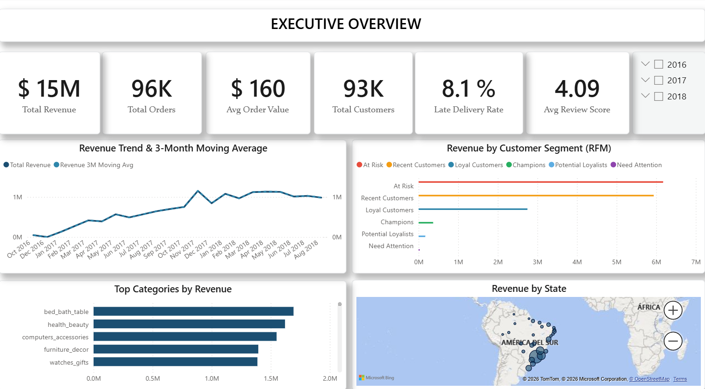
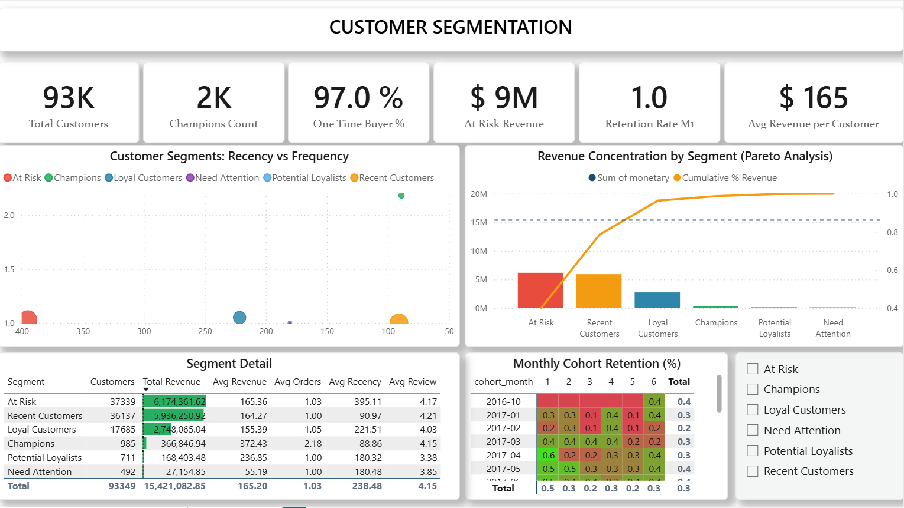
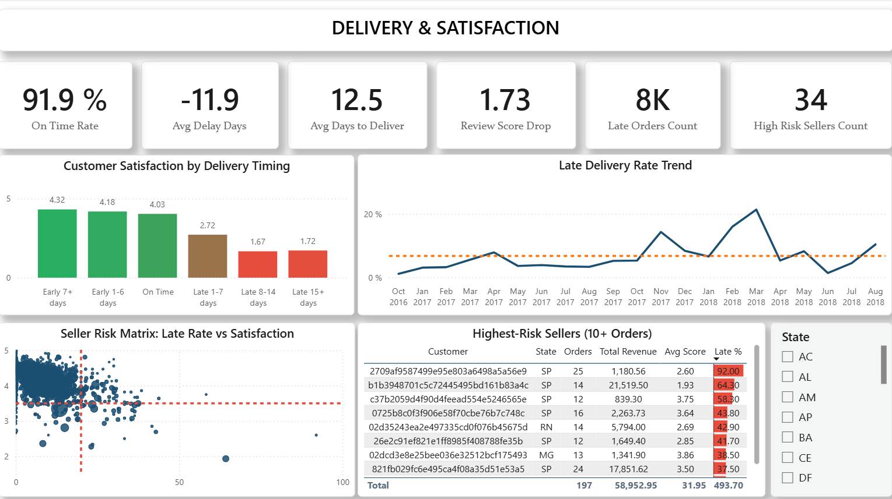

# Olist Retail Analytics — Inteligencia de Comportamiento y Retención de Clientes

## Contexto del Negocio

Olist es un marketplace de comercio electrónico brasileño que conecta pequeñas y medianas
empresas con los principales canales de retail. Entre 2016 y 2018, la plataforma procesó
más de 99,000 órdenes en múltiples categorías de productos y perfiles de vendedores.

La dirección necesitaba ir más allá de los reportes de ventas superficiales para entender
qué estaba impulsando — y limitando — el crecimiento del negocio. La pregunta central:
**¿es esto un problema de adquisición de clientes o de retención?**

Este proyecto construye un pipeline analítico completo desde los datos crudos hasta el
dashboard ejecutivo, respondiendo seis preguntas de negocio que informan directamente
decisiones estratégicas y operativas.

---

## Vista Previa del Dashboard

### Executive Overview


Tendencia de revenue con media móvil de 3 meses, distribución de revenue por segmento RFM,
top categorías, y concentración geográfica de revenue por estado brasileño.

### Customer Segmentation


Scatter RFM, análisis de concentración de revenue tipo Pareto, y un heatmap de retención
de cohortes mensuales que revela que menos del 1% de los clientes regresa tras su primera compra.

### Delivery & Satisfaction


Satisfacción del cliente por tiempo de entrega (escala de color continua), tendencia de
tasa de entregas tardías, y una matriz de riesgo de vendedores que identifica a los de
mayor impacto negativo.

> Reporte interactivo completo: [`04_powerbi/olist_dashboard.pbix`](04_powerbi/olist_dashboard.pbix)

---

## Rol del Analista

Responsabilidad de extremo a extremo del pipeline analítico:

- Perfilamiento de datos y evaluación de calidad en Excel
- Modelado de datos relacional y diseño de esquema en SQL Server
- Pipeline ETL con decisiones de limpieza documentadas
- Capa de vistas analíticas para lógica de negocio reutilizable
- Consultas de negocio basadas en CTEs con funciones de ventana
- Dashboard ejecutivo en Power BI (esquema estrella + DAX + Power Query)

---

## Arquitectura de Datos

**Fuente:** Brazilian E-Commerce Public Dataset — Olist (Kaggle)
**Motor:** SQL Server (principal) | MySQL (validación paralela)
**Modelo:** Esquema estrella — 1 tabla de hechos central + 4 dimensiones analíticas

| Tabla | Filas | Rol |
|---|---|---|
| orders | 99,441 | Tabla de hechos central |
| order_items | 112,650 | Detalle de transacciones |
| order_payments | 103,886 | Métodos de pago |
| order_reviews | 98,410 | Satisfacción del cliente |
| customers | 99,441 | Dimensión de clientes |
| products | 32,951 | Catálogo de productos |
| sellers | 3,095 | Dimensión de vendedores |
| geolocation | 1,000,163 | Referencia geográfica |
| category_translation | 71 | Tabla de lookup |

---

## Hallazgos de Calidad de Datos

Problemas clave identificados durante el perfilamiento en Excel y resueltos en el pipeline SQL:

| Problema | Severidad | Resolución |
|---|---|---|
| order_delivered_customer_date — 2,965 nulos (2.98%) | Alta | Excluidos del análisis de entrega; RFM usa fecha de compra |
| Payments > Orders (103,886 vs 99,441) | Media | Órdenes multi-pago agregadas con SUM() GROUP BY order_id antes del JOIN |
| review_id duplicados en order_reviews | Media | Deduplicados con ROW_NUMBER() PARTITION BY review_id al momento de carga |
| order_id duplicados en reviews (268 órdenes) | Media | Segunda capa de deduplicación: ROW_NUMBER() PARTITION BY order_id en vista v_order_review_agg |
| 2 categorías faltantes en tabla de traducción | Media | Insertadas manualmente: pc_gamer y portateis_cozinha_e_preparadores_de_alimentos |
| 1 orden entregada sin registro de pago | Baja | Excluida de vistas de revenue — no se pueden calcular métricas financieras sin datos de pago |
| customer_id vs customer_unique_id | Nota crítica de diseño | Todo análisis a nivel de cliente usa customer_unique_id (identificador estable de persona real) |

---

## Aspectos Técnicos Destacados

### SQL — Scripts en `/03_sql/`

**`01_ddl.sql`** — Diseño del esquema con FK constraints, índices y decisiones de tipo de dato
(DECIMAL para precios, NVARCHAR para seguridad Unicode, PKs compuestas para order_items y payments)

**`02_data_load.sql`** — Pipeline de BULK INSERT con tablas staging para parseo de fechas y
manejo de nulos. Estrategia de carga en múltiples pasos para orders y reviews para manejar
cadenas vacías en columnas tipadas sin pérdida de datos.

**`03_views.sql`** — 9 vistas analíticas reutilizables que encapsulan toda la lógica de limpieza:

| Vista | Propósito |
|---|---|
| v_delivered_orders | Filtro base: órdenes entregadas con fecha de entrega válida |
| v_order_financials | Revenue por orden — seguro para multi-pago (SUM + ROW_NUMBER) |
| v_order_review_agg | Una review por orden — seguro para duplicados (ROW_NUMBER PARTITION BY order_id) |
| v_delivery_performance | Entrega prometida vs real con buckets de retraso y flag is_late |
| v_product_catalog | Resolución Portugués → Inglés de categorías vía LEFT JOIN |
| v_customer_orders | Historial de órdenes por cliente usando customer_unique_id |
| v_rfm_base | Inputs RFM por cliente con fecha de referencia anclada al dataset |
| v_seller_performance | KPIs por vendedor: revenue, score de reseñas, tasa de retraso |
| v_review_summary | Reseñas unidas a contexto de entrega y financiero |

**`04_analysis.sql`** — 6 consultas de negocio usando:
- CTEs encadenadas
- NTILE(5) para scoring de quintiles RFM
- SUM() OVER con ROWS UNBOUNDED PRECEDING para revenue acumulado del análisis de Pareto
- LAG() para tendencia de revenue mes sobre mes
- AVG() OVER con ROWS BETWEEN para media móvil de 3 meses
- PERCENT_RANK() para scoring compuesto de riesgo de vendedores
- MIN() OVER PARTITION BY para asignación de primera compra en cohortes
- DATEDIFF() MONTH para matriz de retención de cohortes

---

## Preguntas de Negocio y Hallazgos Clave

### BQ1 — Segmentación de Clientes: Análisis RFM + Pareto
*"¿Qué segmentos de clientes generan el 80% del revenue?"*

**Hallazgo 1:** El 78.6% del revenue total proviene de clientes clasificados como "At Risk"
(37,354 clientes) y "Recent Customers" (36,171 clientes) — ambos con una frecuencia de
compra promedio de 1. La plataforma depende casi completamente de compradores de una sola compra.

**Hallazgo 2:** Los Champions — el segmento de mayor valor — representan solo 967 clientes
(1% de la base) con un promedio de $373 por cliente y 2 órdenes. Convertir el 10% de los
clientes At Risk en Loyal recuperaría aproximadamente $617K en revenue anual.

**Implicación de negocio:** Este es un problema de retención, no de adquisición.

---

### BQ2 — Rendimiento de Categorías por Satisfacción y Señal de Recompra
*"¿Qué categorías tienen peores tasas de satisfacción y cómo afecta la recompra?"*

**Hallazgo 3:** office_furniture tiene un 22% de reseñas negativas (scores 1-2) en 1,238
órdenes y $332K en revenue — la categoría de mayor volumen con riesgo de satisfacción
significativo. fashion_male_clothing (23.1%) y audio (21.7%) le siguen.

**Hallazgo 4:** La tasa de clientes repetidores en office_furniture es solo del 3.7% —
una de las más bajas del catálogo. La alta insatisfacción correlaciona directamente con
recompra casi nula en esta categoría. home_appliances, por el contrario, tiene un 13.1%
de clientes repetidores y bajas tasas de negatividad.

**Implicación de negocio:** office_furniture está destruyendo valor de cliente a largo plazo
mientras aparece saludable en las métricas de revenue bruto.

---

### BQ3 — Rendimiento de Entrega vs Satisfacción del Cliente
*"¿Cuál es el tiempo de entrega real vs prometido y cómo impacta la satisfacción?"*

**Hallazgo 5:** El 78% de las órdenes (75,346) llegan más de 7 días antes de la fecha
prometida, con un score promedio de reseña de 4.32 estrellas. Cuando las órdenes llegan
tarde, los scores colapsan: Late 8-14 días promedia 1.67 estrellas. Late 1-7 días promedia
2.72 estrellas. Esto representa una caída de 2.65 estrellas — 61% menos satisfacción —
de entrega anticipada a entrega con retraso moderado.

**Hallazgo 6:** Olist promete fechas de entrega sistemáticamente conservadoras. El riesgo
real de SLA está concentrado en el 6.6% de órdenes que llegan tarde. Un algoritmo más
ajustado de fechas prometidas reduciría el buffer de entrega anticipada mientras protege
el cumplimiento de SLA.

**Hallazgo 7:** Noviembre 2017 muestra un pico de late_pct del 14.3% (vs 3-5% en meses
normales), confirmando el estrés logístico del Black Friday. Febrero-marzo 2018 muestra
un pico sostenido del 16-21%, señalando un problema operacional más allá de la demanda estacional.

---

### BQ4 — Perfil de Riesgo de Vendedores
*"¿Qué vendedores muestran patrones de retraso o baja satisfacción que perjudican la experiencia?"*

**Hallazgo 8:** El vendedor b1b3948701c5c72445495bd161b83a4c tiene un risk_score de 1.0 —
el máximo posible — con un avg_review_score de 1.93 y un 64.3% de tasa de entrega tardía
en 14 órdenes.

**Hallazgo 9:** El riesgo de mayor impacto es el vendedor 2eb70248d66e0e3ef83659f71b244378:
187 órdenes, $39K en revenue, avg_review_score de 2.81, risk_score de 0.908. Alto volumen
combinado con satisfacción consistentemente baja genera el mayor daño acumulado a clientes.

**Implicación de negocio:** El score de riesgo compuesto usando PERCENT_RANK() en ambas
dimensiones identifica dos perfiles de riesgo: vendedores de alta frecuencia con riesgo
moderado (impacto en revenue) y vendedores de baja frecuencia con riesgo extremo (impacto en reputación).

---

### BQ5 — Tendencia de Revenue Mensual y Estacionalidad
*"¿Cómo se ve la tendencia de revenue mes a mes y hay estacionalidad?"*

**Hallazgo 10:** El revenue creció 25x de $46K (octubre 2016) a $1.15M (noviembre 2017)
en 13 meses. La media móvil de 3 meses confirma una tendencia ascendente consistente, no ruido.

**Hallazgo 11:** El Black Friday de noviembre 2017 generó un pico del 53.6% mes sobre mes
— el mayor salto mensual del dataset. El revenue se estabilizó entre $966K y $1.13M desde
enero 2018 en adelante, indicando maduración del mercado más que declive.

**Nota sobre el dataset:** Diciembre 2016 contiene solo 1 orden ($19.62) — los datos están
incompletos para los primeros meses de operación de la plataforma y se excluyen del análisis de tendencia.

---

### BQ6 — Análisis de Retención de Cohortes de Clientes
*"¿Qué porcentaje de clientes regresa a comprar en los meses siguientes a su primera compra?"*

**Hallazgo 12:** La retención al mes 1 nunca supera el 0.7% en ningún cohorte.
Al mes 6, ningún cohorte supera el 0.4%. Este es el hallazgo más crítico del proyecto.

**Implicación de negocio:** Olist opera como una máquina de adquisición pura sin mecanismo
de retención. El caso de negocio para un programa de retención es cuantificable: si la
retención al mes 1 mejorara del 0.5% al 3% en un cohorte promedio de 4,500 nuevos clientes,
con un valor promedio de orden de $160, eso representa aproximadamente $1.3M en revenue
incremental anual — sin adquirir un solo cliente nuevo.

---

## Recomendaciones de Negocio

1. **Lanzar un programa de retención dirigido al segmento At Risk** (37,354 clientes, $6.17M en revenue en riesgo). Una conversión del 5% a Loyal Customers generaría ~$617K en revenue recuperable anualmente.

2. **Auditar la categoría office_furniture** — 22% de tasa de reseñas negativas con $332K en revenue y 3.7% de tasa de repetición. Investigar calidad del producto, cumplimiento de vendedores y estándares de empaque específicamente para esta categoría.

3. **Recalibrar las fechas de entrega prometidas** — El 78% de las órdenes llegan 7+ días antes, creando un buffer de SLA falso. Fechas prometidas más ajustadas reducirían el costo logístico mientras mantienen la satisfacción del cliente.

4. **Implementar revisiones de scorecard de vendedores** — Usar el score de riesgo compuesto para activar revisiones trimestrales para vendedores High Risk. Vendedores con risk_score > 0.85 en ambas dimensiones deberían enfrentar planes de mejora de rendimiento o restricciones en el marketplace.

5. **Priorizar la planificación logística para Black Friday** — Noviembre muestra una degradación consistente del SLA. Pre-posicionar inventario y pre-negociar capacidad de transportistas antes de octubre protegería el mes de mayor revenue del año.

---

## Estructura del Proyecto

```
Olist_Retail_Analytics/
├── 01_raw_data/          ← Archivos CSV originales (sin modificar)
├── 02_excel/
│   ├── olist_exploration.xlsx    ← Libro de perfilamiento de datos
│   │   ├── Pestaña: Data_Dictionary
│   │   ├── Pestaña: Quality_Report
│   │   └── Pestaña: Findings
│   └── screenshots/              ← Capturas de tablas dinámicas
├── 03_sql/
│   ├── 01_ddl_sqlserver.sql
│   ├── 01_ddl_mysql.sql
│   ├── 02_data_load_sqlserver.sql
│   ├── 02_data_load_mysql.sql
│   ├── 03_views.sql
│   └── 04_analysis.sql
├── 04_powerbi/
│   └── olist_dashboard.pbix      ← (en progreso)
└── README.md
```

---

## Herramientas y Stack

| Herramienta | Uso |
|---|---|
| Microsoft Excel 365 | Perfilamiento de datos, análisis con tablas dinámicas, documentación de hallazgos |
| SQL Server / SSMS | Motor principal — DDL, carga de datos, vistas, análisis |
| MySQL / Workbench | Entorno de validación paralela |
| Power BI Desktop | Modelo de esquema estrella, medidas DAX, dashboard ejecutivo |

---

## Dataset

Brazilian E-Commerce Public Dataset by Olist
Fuente: [Kaggle](https://www.kaggle.com/datasets/olistbr/brazilian-ecommerce)
Licencia: CC BY-NC-SA 4.0
Período: Octubre 2016 — Agosto 2018
